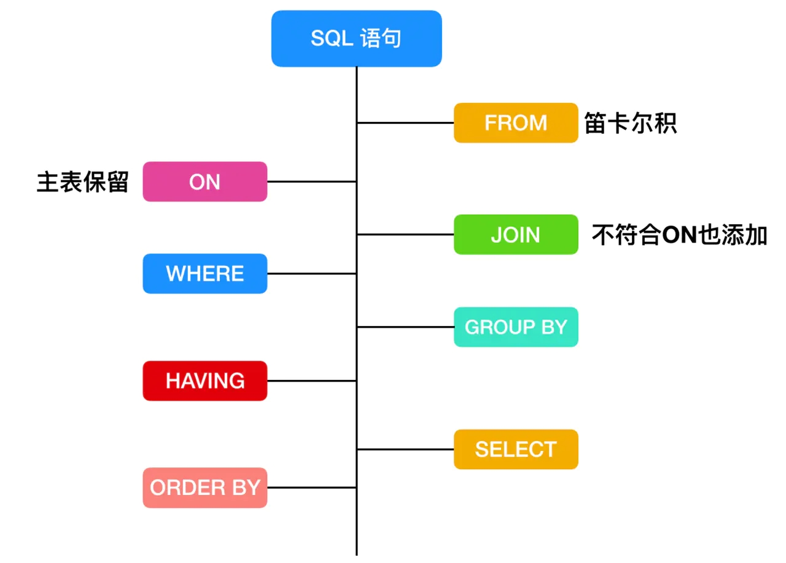

# mysql 执行顺序

```sql
1 from
2 on
# (内连接 外连接：左连接、右连接、全连接 交叉连接)
3 join
4 where·
5 group by
6 having
7 select
8 order by
9 distinct
10 limit
```



# sql 优化

```sql
## 原sql：
select
            product_id as productId,
            supplier_id as supplierId,
            first_category_id as firstCategoryId,
            first_category_name as firstCategoryName,
            second_category_id as secondCategoryId,
            second_category_name as secondCategoryName,
            third_category_id as thirdCategoryId,
            price as price,
            group_price as groupPrice,
            is_toggroup_product as isToggroupProduct,
            f_category_1_names as fCategory1Names,
            f_category_1_ids as fCategory1Ids,
            f_category_2_names as fCategory2Names,
            f_category_2_ids as fCategory2Ids,
            derive_addval_totalprice as deriveAddvalTotalPrice,
            f_category_3_names as fCategory3Names,
            f_category_3_ids as fCategory3Ids,
            f_category3_sale_point as fCategory3SalePoint,
            sales_volume7 as salesVolume7,
            sales_volume as salesVolume,
            support_platform as supportPlatform,
            create_uid as createUid
        from derive_product where shelf_status = 1 limit 1,500;
##优化建议
 1. 首先改查询没有使用索引，进行了全表扫描。
     MySQL对于 limit m,n 这种类型的深度分页操作，如果查询没有使用索引，MySQL会去主键索引上取出 m + n 条包含所有字段的数据，返回mysql server层；而后再在mysql server层从第 m行开始取出 n行，返回客户端。这种 limit m,n 的方式随着 m 的增大，innodb层返回 server层的数据量（m + n）就越大，io消耗会越来越高，查询会越来越慢。
     建议为该表添加 (shelf_status)索引，同时将该SQL改写为 select xx from derive_product  a join (select product_id from derive_product where shelf_status = 1  limit 145000,500) b on a.product_id  = b.product_id;  SQL改写之后其中的子查询使用覆盖索引，同时，连接查询时子查询中直接通过索引取出id值再与原表做关联查询，针对 limit m,n 这种查询 innodb层需要返回server层的数据量只有满足product_id  等值的 500条，io消耗大大降低，建议优化
     
## 优化后 
select
            a.product_id as productId,
            supplier_id as supplierId,
            first_category_id as firstCategoryId,
            first_category_name as firstCategoryName,
            second_category_id as secondCategoryId,
            second_category_name as secondCategoryName,
            third_category_id as thirdCategoryId,
            third_category_name as thirdCategoryName,
            first_onshelf_time as firstOnShelfTime,
            square_portal_img as squarePortalImg,
            square_portal_img_webp as squarePortalImgWebp,
            sale_point as salePoint,
            short_title as shortTitle,
            title as title,
            shelf_status as shelfStatus,
            supplier_background as supplierBackground,
            store_name as storeName,
            su_id as suId,
            min_duration as minDuration,
            price as price,
            group_price as groupPrice,
            is_toggroup_product as isToggroupProduct,
            f_category_1_names as fCategory1Names,
            f_category_1_ids as fCategory1Ids,
            f_category_2_names as fCategory2Names,
            f_category_2_ids as fCategory2Ids,
            derive_addval_totalprice as deriveAddvalTotalPrice,
            f_category_3_names as fCategory3Names,
            f_category_3_ids as fCategory3Ids,
            f_category3_sale_point as fCategory3SalePoint,
            sales_volume7 as salesVolume7,
            sales_volume as salesVolume,
            support_platform as supportPlatform,
            create_uid as createUid
        from derive_product a join (select product_id from derive_product where shelf_status = 1 limit 145000,500) b on a.product_id  = b.product_id 
```

# mysql性能

一般的 MySQL，扛到每秒 2k 个请求就差不多了


